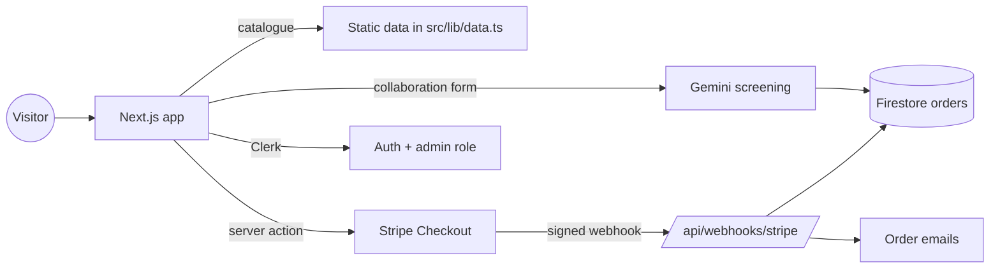

<div align="center">

# Sol & Clay

### A storefront for handmade ceramics and home decor

A Next.js shop with collections, product pages, a cart, Stripe checkout, Clerk sign-in and a collaboration form that an AI model screens before the studio reads it.


[](./LICENSE)

[Features](#features) · [Quick start](#quick-start) · [How it works](#how-it-works) · [Security](#security) · [Status](#project-status)

</div>

---

## About

Sol & Clay is a front end and light back end for a small ceramics brand. Visitors browse six collections and fifteen products, add items to a cart, and pay through Stripe Checkout. Studios and makers can send a collaboration request, which Gemini screens for spam and fit before it is saved for review. Signed-in customers get a cart that follows them across devices.

It is a good base for a small shop, but several parts are still placeholders (the catalogue is static, two forms do not send anything, and checkout trusts prices sent by the browser). [Project status](#project-status) lists them.

## Table of contents

- [Features](#features)
- [Quick start](#quick-start)
- [Configuration](#configuration)
- [How it works](#how-it-works)
- [Tech stack](#tech-stack)
- [Project structure](#project-structure)
- [Security](#security)
- [Project status](#project-status)
- [Documentation](#documentation)
- [Contributing](#contributing)
- [License](#license)

## Features

| Feature | Notes |
| :--- | :--- |
| Collections and products | 6 collections and 15 products with story, materials, dimensions and stock, defined in code |
| Cart | Browser cart, synced to Firestore for signed-in users |
| Checkout | Stripe Checkout in US dollars, with a webhook that records paid orders in Firestore |
| Order emails | Customer confirmation and admin notice, once an email provider is set up |
| Accounts | Clerk sign up, login and password reset, and a profile page |
| Collaboration requests | Form with an optional image upload, screened by Gemini 2.5 Flash |
| Admin page | Role-protected `/admin` page for collaboration requests |
| Content pages | About, FAQ, shipping and returns, contact, a custom-order request form |
| Design | Earthy theme, animated background, light and dark mode, responsive layout |

## Quick start

**Prerequisites:** Node.js 20+, a Clerk application, a Firebase project (Firestore and Storage), a Stripe account (test mode is fine) and a Google AI key.

```bash
git clone https://github.com/ArrinPaul/sol-and-clay.git
cd sol-and-clay
npm install
# create .env.local (see Configuration)
npm run dev          # http://localhost:9003
```

`npm run dev` listens on port **9003**, while `npm run start` uses **9002**. Other scripts: `npm run build`, `npm run lint`, `npm run typecheck`, and `npm run genkit:dev` for the Genkit developer UI.

For the webhook in development, forward Stripe events with `stripe listen --forward-to localhost:9003/api/webhooks/stripe`. Step-by-step service setup is in [`SETUP_GUIDE.md`](./SETUP_GUIDE.md) and [`FIREBASE_SETUP.md`](./FIREBASE_SETUP.md).

## Configuration

Create `.env.local`. There is no `.env.example`, so these are the names the code reads:

| Variable | Purpose |
| :--- | :--- |
| `NEXT_PUBLIC_CLERK_PUBLISHABLE_KEY`, `CLERK_SECRET_KEY` | Clerk |
| `NEXT_PUBLIC_FIREBASE_*` (API key, auth domain, project id, storage bucket, sender id, app id, measurement id) | Firebase web config |
| `FIREBASE_SERVICE_ACCOUNT_KEY` | The service-account JSON as one string. The server uses it to write to Firestore and Storage |
| `STRIPE_SECRET_KEY`, `STRIPE_WEBHOOK_SECRET` | Stripe checkout and webhook verification |
| `NEXT_PUBLIC_STRIPE_PUBLISHABLE_KEY` | Stripe on the client |
| `GEMINI_API_KEY` (or `GOOGLE_API_KEY`) | Gemini through Genkit. Read by the Genkit Google plugin |
| `EMAIL_PROVIDER`, `EMAIL_FROM`, `ADMIN_EMAIL`, and `SENDGRID_API_KEY` or `RESEND_API_KEY` | Email. Without `EMAIL_PROVIDER` emails are only logged to the console |
| `NEXT_PUBLIC_SITE_URL` | Public site address used in emails |

To make a user an administrator, set `role: "admin"` in their Clerk public metadata and include it in the session token's `metadata` claim.

## How it works



- **Checkout.** A server action builds a Stripe Checkout session from the cart and redirects the buyer to Stripe. When Stripe reports a completed payment, the webhook (signature-verified) saves an order in Firestore and sends emails.
- **Collaboration form.** The server action validates the form, uploads an optional image to Firebase Storage, asks Gemini whether the request is spam or on-brand, and saves the result with a status: `pending_review`, `rejected_spam` or `rejected_irrelevant`.
- **Rate limits.** Checkout allows 5 requests per minute and forms 3 per minute per client address, counted in server memory.
- **Firestore rules** deny all client access except public reads of `collections` and `products`. Writes happen only on the server with the Admin SDK.

## Tech stack

| Layer | Technology |
| :--- | :--- |
| Framework | Next.js 15 (App Router, server actions), React 18, TypeScript |
| UI | Tailwind CSS 3, Radix UI, shadcn/ui, Framer Motion, Lucide |
| Auth | Clerk |
| Data and files | Firebase Firestore and Storage (Admin SDK on the server) |
| Payments | Stripe Checkout |
| AI | Genkit with Google Gemini 2.5 Flash |
| Hosting | Vercel (configured), Firebase App Hosting file also present |

## Project structure

```
src/
  app/              pages, server actions (cart, collaboration, stripe) and the Stripe webhook route
  components/       layout, forms, background, shadcn/ui
  ai/               Genkit setup and the collaboration-filter flow
  firebase/         client config and Admin SDK helpers
  lib/              static catalogue, types, rate limiter, email, Stripe helpers
  hooks/            cart and UI hooks
  middleware.ts     Clerk route protection
firestore.rules     Firestore security rules
```

## Security

- **Checkout trusts the browser's prices.** The server action takes each item's title, price and quantity from the cart sent by the client and creates the Stripe line items from them, without looking prices up from the catalogue. A modified request can pay a different amount. Prices must be re-read from the server's catalogue before this is used for real sales.
- **No stock check.** Stock numbers are shown but never checked or reduced.
- **Uploads are not validated.** The collaboration form stores whatever file is sent, with its declared type and no size limit, and makes it public.
- **The rate limiter trusts the first `X-Forwarded-For` address**, which a client can set, and it lives in memory, so it is easy to bypass and resets on restart.
- The AI screening sees a link to the image and portfolio, not their content, and is only a first filter.
- Order and contact data is kept in Firestore with client access denied by the rules. The Stripe webhook verifies its signature.
- The admin page checks the Clerk role on the server before rendering.
- `build.log` is committed and contains a local network address. Remove it from the repository.

## Project status

A nearly complete storefront prototype with some placeholders. Stated plainly:

- **The catalogue is static.** Collections, products, prices, ratings, stock, testimonials and the "maker of the month" are written in `src/lib/data.ts`. The Firestore `products` rules and collections are not used for reading.
- **The admin dashboard shows sample rows** from the same file, not the real collaboration requests stored in Firestore.
- **The contact form and the custom-order form send nothing.** They wait one second or log to the console and then show a "thank you" message.
- **Orders have no shipping address.** The Stripe session does not ask for one, so a paid order cannot be shipped from the data it stores. The shipping page's mention of expedited options at checkout is not implemented.
- **Emails only work once configured**, and the code that sends them expects the `@sendgrid/mail` or `resend` package, which is not in `package.json`.
- The Stripe order's product ids are Stripe's generated ids, not the site's product ids (the site's ids are only in the session metadata).
- **`npm ci` fails** because `package-lock.json` is out of sync with `package.json` (for example the lock file has Genkit 1.27 while `^1.20.0` now resolves to 1.42). Use `npm install`, which is also what `vercel.json` runs, and regenerate the lock file.
- There are no automated tests and no CI. The build, lint and type check were not run when this README was written, so the quick start is otherwise unverified.
- The previous live demo link in the repository settings (`sol-and-clay.vercel.app`) may be offline.

## Documentation

- [`SETUP_GUIDE.md`](./SETUP_GUIDE.md): creating the Firebase, Clerk and Stripe projects
- [`FIREBASE_SETUP.md`](./FIREBASE_SETUP.md): Firebase configuration after the move to Clerk
- [`docs/backend.json`](./docs/backend.json): data model used when the project was scaffolded

## Contributing

Issues and pull requests are welcome. The most valuable fixes are server-side price lookup in checkout, collecting a shipping address, wiring the contact and custom-order forms, and reading the catalogue and admin data from Firestore. Please do not commit `.env` files or keys.

## License

Released under the [MIT License](./LICENSE). Copyright (c) 2026 ArrinPaul.
